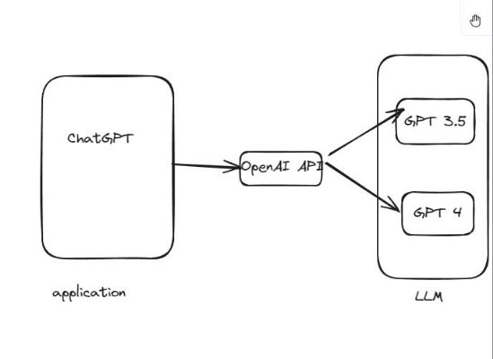
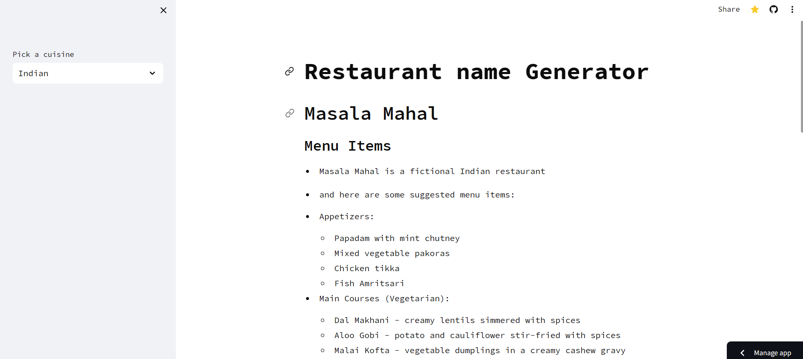

# Restaurant Name and Menu Generator

This repository contains a Python script that generates unique and catchy restaurant names and corresponding menu items using the LangChain framework with the Cohere Large Language Model (LLM). This tool is designed to help entrepreneurs and restaurateurs come up with creative and appealing names and menu ideas for their new dining establishments.

## Features

- **Generate Unique Restaurant Names**: Based on the specified cuisine type, the script generates creative and memorable restaurant names.
- **Create Themed Menus**: Generates a list of menu items along with descriptions tailored to the specified cuisine type.

# Study About Langchain ⛓️🔗

## langchain

What is LangChain ?

### What kind of problem does it address ?



### Limitations of this architecture

- Higher cost

- No access to real time knowledge No access to private data sources

### Langchain is a framework that allows you to build applications using LLMs


## Agents


## 🚀 Demo :



## used LLM

`Cohere `

## Requirements

- Python 3.12
- LangChain
- Cohere Python SDK

## Installation

1. **Clone the repository:**

   ```bash
   git clone https://github.com/mihirh19/Restaurant_name_generator
   cd Restaurant_name_generator
   ```

2. **Install the required packages:**
   ```bash
   pip install -r requirements.txt
   ```
3. **Set up your Cohere API key:**
   - Sign up at [Cohere's website](https://cohere.com/) to get your API key. Once you have your API key, update the cohere_api_key variable in the script:
   - In `.streamlit` folder create a `secrets.toml` file and write api key in file.
   ```toml
   COHERE_API_KEY = "Your Api key"
   ```

## Usage

1. **Run the script**
   ```bash
   streamlit run .\main.py
   ```

## Author

👤 **Mihir Hadavani**

- Twitter: [@mihirh21](https://twitter.com/mihirh21)
- Github: [@mihirh19](https://github.com/mihirh19)
- LinkedIn: [@mihir-hadavani-996263232](https://linkedin.com/in/mihir-hadavani-996263232)

## Show your support

Give a ⭐️ if this project helped you!
